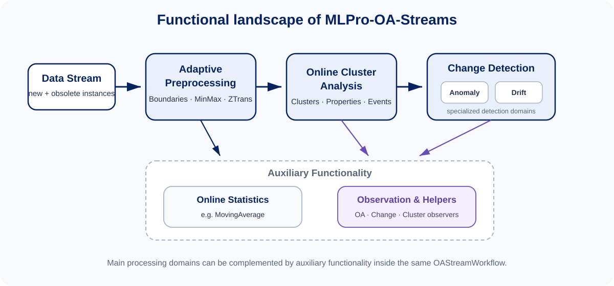

.. _target_oa_streams:

Online-Adaptive Data Stream Processing (OADSP)
==============================================

Overview
--------

MLPro-OA-Streams extends the generic data-stream processing model of :ref:`MLPro-BF-Streams <target_bf_streams>` with the
paradigm-independent adaptation semantics of :ref:`MLPro-BF-ML <target_bf_ml>`. The result is a framework for building stream
processing pipelines whose tasks can continuously adapt while data is flowing through them.

The central idea is simple::

    BF-Streams  -> stream instances, tasks, workflows, scenarios
    BF-ML       -> models, adaptation, events, hyperparameters
    -----------------------------------------------------------
    OA-Streams  -> online-adaptive stream tasks and workflows

At the object level this combination is explicit: ``OAStreamTask`` combines ``StreamTask`` and ``Model``;
``OAStreamWorkflow`` combines ``StreamWorkflow`` and ``AWorkflow``; and ``OAStreamScenario`` specializes the stream-scenario
model for adaptive workflows. This keeps OA processing interoperable with the execution, multitasking, visualization, event,
and persistence mechanisms already defined in the lower MLPro layers.

OA-Streams is not limited to one learning algorithm or one application domain. It provides the infrastructure and reusable
processing tasks for adaptive preprocessing, online cluster analysis, change detection, statistics, and observation. Concrete
algorithms can therefore be composed into larger adaptive pipelines without creating a new runtime model for every method.

Adaptation in a data stream
---------------------------

A stream is not only a sequence of new samples. In dynamic processing chains, instances can also become obsolete, preprocessing
parameters can change, and downstream models may keep internal state that depends on earlier transformations. OA-Streams makes
these situations explicit through a stream-specific adaptation lifecycle.

``OAStreamTask`` supports:

- **Forward adaptation** on new stream instances.
- **Reverse adaptation** on obsolete or removed instances where an algorithm supports undoing their influence.
- **Pre- and post-adaptation hooks** for algorithm-specific processing around the instance-wise adaptation loop.
- **Renormalization adaptation** for tasks whose buffered internal data must be transformed again after an adaptive normalizer
  changes its parameters.
- **Typed adaptation events** through ``OAStreamAdaptation`` and ``OAStreamAdaptationType`` so that changes can propagate through
  a workflow without tightly coupling the participating tasks.

This event-oriented interaction is particularly important in multi-stage pipelines. For example, an adaptive boundary detector
may change the observed data range, an adaptive normalizer can react to the new boundaries, and downstream tasks can then
renormalize buffered state. Adaptation therefore becomes a property of the complete processing chain rather than an isolated
method call inside one algorithm.

Functional scope
----------------

**Adaptive preprocessing**
    Boundary detection and online-adaptive MinMax/Z-transformation normalizers provide continuously updated preprocessing.
    OA processing tasks can be combined with non-adaptive BF-Streams tasks such as rearrangers or windows in the same workflow.

**Online cluster analysis**
    ``ClusterAnalyzer`` standardizes adaptive cluster management, memberships and influences, cluster creation/removal events,
    visualization, renormalization, and extensible cluster properties.

**Change detection**
    Change detection is the common framework-level domain for identifying relevant changes in an evolving stream. ``Change`` and
    ``ChangeDetector`` provide the shared event, status, buffering, and visualization semantics. **Anomaly detection** and
    **drift detection** are the two specialized detection domains built on top of this common foundation.

**Online statistics**
    Tasks such as ``MovingAverage`` incrementally summarize the active stream context, can remove obsolete-instance influence,
    and can renormalize their internal state when an upstream normalizer adapts.

**Observation**
    OA/change/cluster observers provide higher-level visualization and monitoring of adaptive processing chains without becoming
    part of the processing logic itself.

How to read this section
------------------------

Start with :ref:`OA-Streams Overview <target_oa_stream_overview>` for the core objects and processing lifecycle. The following
sections then cover adaptive preprocessing, cluster analysis, change detection and its anomaly/drift specializations, online
statistics, and observation. Executable howtos are linked from the corresponding pages through their cross-reference sections.

.. toctree::
   :maxdepth: 1

   streams/01_overview
   streams/10_preprocessing
   streams/20_cluster_analysis
   streams/30_change_detection
   streams/30_change_detection/10_anomaly_detection
   streams/30_change_detection/20_drift_detection
   streams/40_statistics
   streams/99_helpers

**Cross reference**

- :ref:`Howtos OA-Streams <target_appendix1_OA_streams>`
- :ref:`API reference: MLPro-OA-Streams <target_api_oa_streams>`
- :ref:`BF-Streams: Data stream processing <target_bf_streams>`
- :ref:`BF-ML: Machine learning foundations <target_bf_ml>`
- `Paper "MLPro 2.0 - Online machine learning in Python" (2025) <https://doi.org/10.1016/j.mlwa.2025.100715>`_
