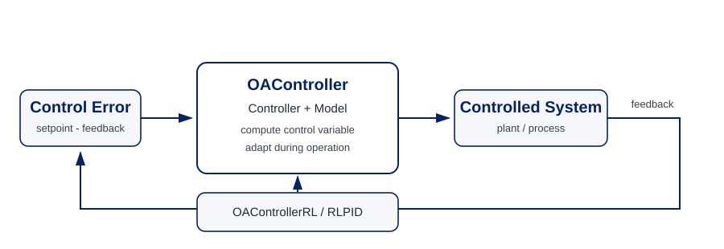

.. _target_oa_control:

Online-Adaptive Closed-Loop Control
===================================

Overview
--------

MLPro-OA-Control extends the closed-loop control abstractions of :ref:`MLPro-BF-Control <target_bf_control>` with the
paradigm-independent adaptation semantics of :ref:`MLPro-BF-ML <target_bf_ml>`. Its purpose is to support controllers that can
change their internal policy while the control loop is running.

The central abstraction is ``OAController``. It combines the classical ``Controller`` contract with the adaptive ``Model``
contract. The controller therefore remains a regular MLPro control task, but it can additionally adapt from the control context
observed during operation.

The important design principle is separation of concerns: BF-Control defines the control-loop semantics, BF-ML defines generic
adaptation semantics, and OA-Control connects both without introducing a second control runtime.

OAController
------------

``OAController`` is the framework template for an online-adaptive controller. It inherits from ``Controller`` and ``Model`` and
therefore participates in both the control workflow and the MLPro adaptation lifecycle.

During each processing cycle the controller:

1. receives the current ``ControlError`` from the control workflow,
2. computes the next ``ControlVariable`` using the regular controller interface,
3. publishes that control variable back into the workflow, and
4. calls its adaptive part with the current control error and the generated control variable.

A custom OA controller implements the normal controller computation together with ``_adapt()``. This keeps the controller's
online-learning mechanism local to the controller while the surrounding control system continues to use the standard BF-Control
objects and workflow semantics.

``OAController`` also defines a dedicated setpoint-change handler hook. Concrete controllers can use it to decide how adaptation
should react when the operating target itself changes.

RL-based online-adaptive controllers
------------------------------------

``OAControllerRL`` is the active MLPro wrapper for reinforcement-learning policies. It turns a regular MLPro-RL ``Policy`` and
reward function into an ``OAController``.

The wrapper converts the current ``ControlError`` into an RL ``State`` and lets the wrapped policy compute an ``Action``. The
action is converted back into a ``ControlVariable`` for the control workflow. From the second cycle onward, the wrapper builds a
SARS transition from the previous state/action, the current state, and the reward computed by the supplied reward function. This
transition is then used to adapt the wrapped policy online.

Conceptually::

    ControlError
        |
        v
    RL State ---> RL Policy ---> RL Action ---> ControlVariable
        ^              |
        |              | adapt from SARS
        +---- Reward <-+

This wrapper is deliberately algorithm-neutral. Any compatible MLPro-RL policy can provide the learning algorithm while
OA-Control provides the integration into the closed-loop control runtime.

RLPID
-----

``RLPID`` is the current native OA-Control policy for adaptive PID control. It combines a conventional BF-Control
``PIDController`` with an internal RL policy that tunes the PID parameters during operation.

The two levels have distinct roles:

**Classical control**
    The internal ``PIDController`` computes the actual control output from the current control error.

**Online adaptation**
    The internal RL policy adapts the PID parameters ``Kp``, ``Tn``, and ``Tv``. Its actions therefore change the controller
    parametrization rather than replacing the PID control law itself.

This provides a hybrid architecture in which a well-known control structure remains responsible for the immediate control
action while reinforcement learning continuously optimizes its tuning.

The implementation exposes the hyperparameters of the internal policy through the MLPro hyperparameter abstractions and reuses
its adaptivity, visualization, and shared-object mechanisms.

Current functional scope
------------------------

The currently active OA-Control implementation is intentionally focused. The operational building blocks are:

- ``OAController`` as the generic online-adaptive controller template;
- ``OAControllerRL`` as the RL-policy wrapper;
- ``RLPID`` as the native RL-based adaptive PID policy.

Several additional names are already reserved in ``mlpro.oa.control.basics`` for future online-adaptive multi-controllers,
controlled systems, panels, workflows, complete control systems, and control-specific training. These classes are currently
placeholders and are therefore not presented here as active functionality. Likewise, the experimental OA-Control basic control
system and function wrapper are disabled in the source tree.

The available OA-Control howto script is currently disabled as well. Consequently, no executable OA-Control howto is advertised
as active documentation at this point.

Using OA-Control in the MLPro stack
-----------------------------------

OA-Control is designed as an extension layer rather than a replacement for BF-Control. A typical implementation therefore starts
with the same controlled system, control panel, operators, and workflow concepts described in BF-Control and replaces only the
controller stage by an adaptive controller.

The resulting dependency chain is::

    BF-Control        -> control-loop semantics
    BF-ML             -> adaptation semantics
    MLPro-RL          -> optional learning algorithms
    ------------------------------------------------
    MLPro-OA-Control  -> online-adaptive controller integration

This arrangement keeps adaptive and non-adaptive controllers interoperable inside the broader MLPro control architecture.

**Cross reference**

- :ref:`API reference: MLPro-OA-Control <target_api_oa_control>`
- :ref:`API reference: OA-Control controllers <target_api_oa_control_controllers>`
- :ref:`BF-Control: Closed-loop control <target_bf_control>`
- :ref:`BF-ML: Machine learning foundations <target_bf_ml>`
- `Paper "Online-adaptive PID control using Reinforcement Learning" (Preprint) <https://www.researchgate.net/publication/388816787_Online-adaptive_PID_control_using_Reinforcement_Learning>`_
- `Paper "Online-adaptive PID control using Reinforcement Learning" (GitHub repo) <https://github.com/fhswf/paper-da-ieee-codit-2025>`_
