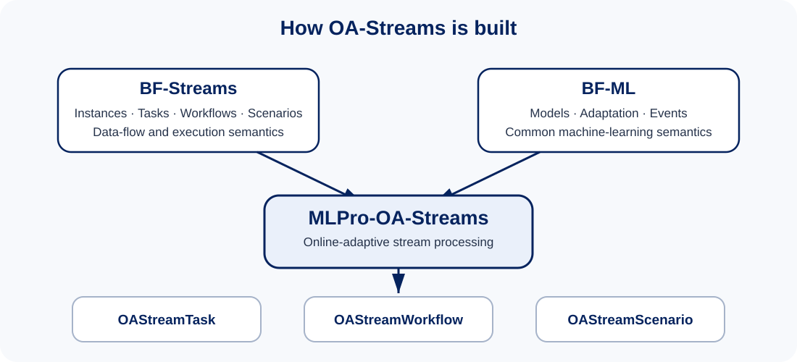
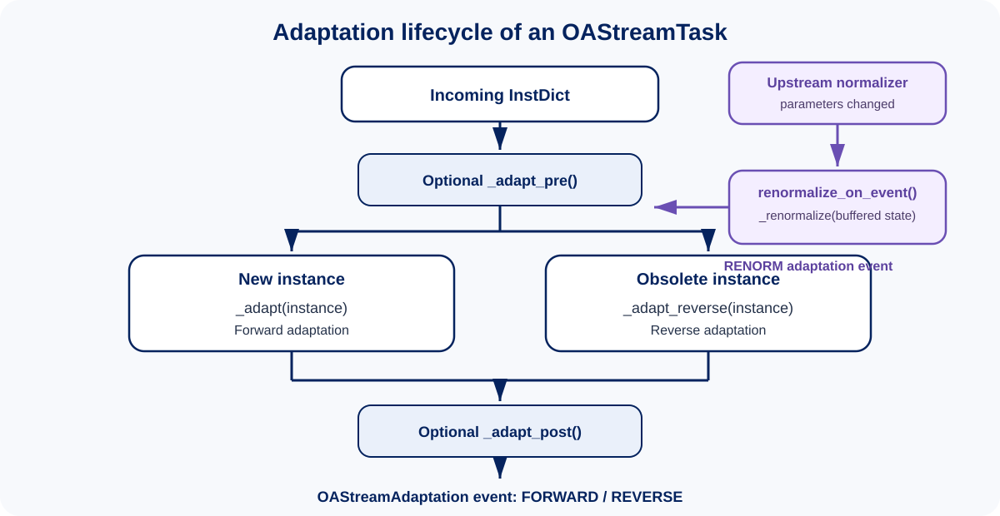

.. _target_oa_stream_overview:

Overview
========

MLPro-OA-Streams is the common runtime and adaptation layer for online-adaptive stream processing in MLPro. It combines the
stream-processing abstractions of :ref:`BF-Streams <target_bf_streams>` with the adaptive-model abstractions of
:ref:`BF-ML <target_bf_ml>` without introducing a separate execution model.

The core objects are:

.. _target_oa_stream_tasks:

**OAStreamTask**
    The elementary adaptive processing unit. It inherits the stream-processing behavior of ``StreamTask`` and the adaptation,
    event, buffering, visualization, and model semantics of ``Model``.

.. _target_oa_stream_workflows:

**OAStreamWorkflow**
    A processing graph for adaptive and non-adaptive stream tasks. Because it also inherits from ``AWorkflow``, the complete
    graph behaves as an adaptive model and can propagate adaptivity to its contained tasks.

**OAStreamScenario**
    The executable context that binds a stream and an ``OAStreamWorkflow``. It reuses the simulation/real-operation lifecycle of
    BF scenarios and assigns the active stream to the workflow's shared object.

**OAStreamShared**
    The shared-data object used by OA workflows. It extends ``StreamShared`` and therefore preserves the established instance
    exchange model of BF-Streams.

**OAStreamAdaptation / OAStreamAdaptationType**
    Stream-specific adaptation events. In addition to the generic BF-ML adaptation semantics they distinguish reverse and
    renormalization adaptations and carry the number of affected stream instances.

From stream processing to online adaptation
-------------------------------------------

The fundamental processing unit remains ``InstDict``. Each entry contains an instance id, an instance type, and an ``Instance``.
New and obsolete instances can therefore be handled differently during adaptation.

Forward adaptation is the normal online-learning direction: a newly arriving instance changes the internal model. Reverse
adaptation is the complementary mechanism for forgetting or compensating an instance that leaves the active processing context,
for example when a sliding window evicts old data.

The pre/post hooks allow algorithms to perform one adaptation step around a complete batch of incoming instance changes instead
of only reacting instance by instance.

Event-oriented adaptation chains
---------------------------------

Online adaptation becomes especially useful when tasks cooperate. OA-Streams builds on MLPro's event system so that one task can
react to a structural change in another without hard-coded control flow.

A typical preprocessing chain is::

    Stream
      |
    BoundaryDetector
      |  changed boundaries
      v
    Adaptive Normalizer
      |  changed normalization parameters
      v
    Downstream OA task(s)
      |  renormalize buffered internal data
      v
    Further processing / analysis

``renormalize_on_event()`` is provided by ``OAStreamTask`` exactly for this purpose. A task can register the handler on an
adaptive normalizer and implement ``_renormalize()`` for its own internal buffers. A successful renormalization is reported as
an ``OAStreamAdaptationType.RENORM`` adaptation.

This mechanism turns adaptation into a coordinated property of the workflow rather than an isolated behavior of one task.

Composition with BF-Streams
---------------------------

OA workflows are intentionally hybrid. A workflow may contain adaptive OA tasks and ordinary BF stream tasks side by side. This
is useful because not every processing step needs to learn. Rearranging dimensions, buffering a window, deriving features, or
other deterministic processing can remain in BF-Streams while only selected stages adapt online.

The same design also preserves MLPro's multitasking model. Tasks may run synchronously or asynchronously according to their
configured processing range, and visualization/logging remain available throughout the pipeline.

Executable howtos demonstrate adaptive normalization in 2D, 3D, and nD, hybrid pipelines containing BF and OA tasks, a complex
parallel preprocessing workflow, and observation of workflows containing boundary detection, normalization, and online
statistics.

**Cross reference**

- :ref:`Howtos OA-Streams <target_appendix1_OA_streams>`
- :ref:`Howto OA-PP-121: Complex preprocessing with parallel tasks <Howto_OA_PP_121>`
- :ref:`API reference: MLPro-OA-Streams <target_api_oa_streams>`
- :ref:`BF-Streams: Data stream processing <target_bf_streams>`
- :ref:`BF-ML: Adaptive models and workflows <target_bf_ml>`
