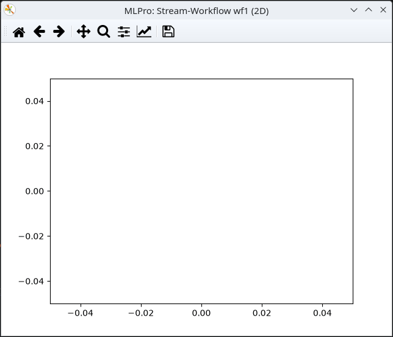

.. _Howto BF STREAMS CLUSTER 002:

Howto BF-STREAMS-CLUSTER-002: One Static Fixed 2D Cluster
=========================================================

**Executable code**

.. literalinclude:: ../../../../../../../../../test/howtos/bf/streams/stream_generation/cluster/howto_bf_streams_cluster_002_1_cluster_static_fix_2d.py
   :language: python

**Results**

**Cross Reference**
    - :ref:`API Reference: Streams <target_ap_bf_streams>`
