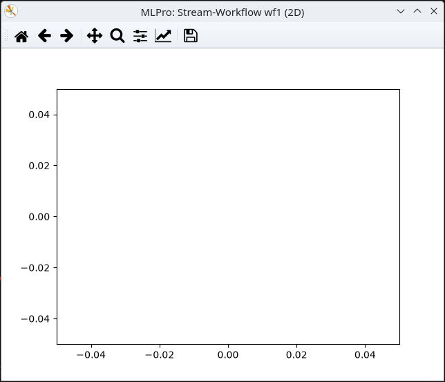

.. _Howto BF STREAMS CLUSTER 004:

Howto BF-STREAMS-CLUSTER-004: One Static Random 2D Cluster with Outliers
=======================================================================

**Executable code**

.. literalinclude:: ../../../../../../../../../test/howtos/bf/streams/stream_generation/cluster/howto_bf_streams_cluster_004_1_cluster_static_rnd_2d_outlier.py
   :language: python

**Results**

**Cross Reference**
    - :ref:`API Reference: Streams <target_ap_bf_streams>`
