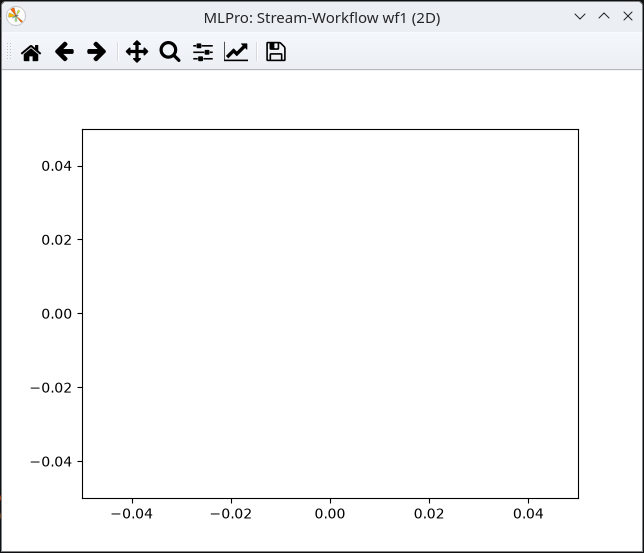

.. _Howto BF STREAMS CLUSTER 005:

Howto BF-STREAMS-CLUSTER-005: One Static Random 2D Cluster with Rescaled Outliers
================================================================================

**Executable code**

.. literalinclude:: ../../../../../../../../../test/howtos/bf/streams/stream_generation/cluster/howto_bf_streams_cluster_005_1_cluster_static_rnd_2d_outlier_rescaled.py
   :language: python

**Results**

**Cross Reference**
    - :ref:`API Reference: Streams <target_ap_bf_streams>`
