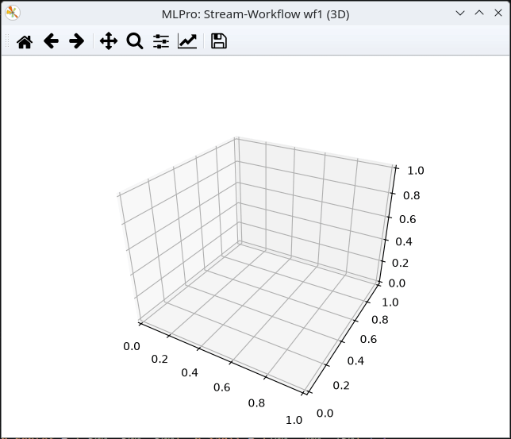

.. _Howto BF STREAMS MULTICLUSTER 006:

Howto BF-STREAMS-MULTICLUSTER-006: Two Static Fixed 3D Clusters (Sequential)
===========================================================================

**Executable code**

.. literalinclude:: ../../../../../../../../../test/howtos/bf/streams/stream_generation/multicluster/howto_bf_streams_multicluster_006_2_clusters_static_fix_seq_3d.py
   :language: python

**Results**

**Cross Reference**
    - :ref:`API Reference: Streams <target_ap_bf_streams>`
