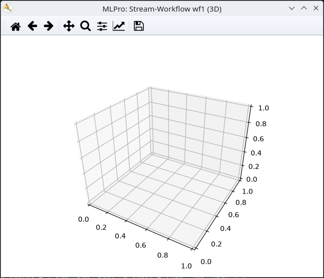

.. _Howto BF STREAMS MULTICLUSTER 007:

Howto BF-STREAMS-MULTICLUSTER-007: Two Static Fixed 3D Clusters (Parallel)
=========================================================================

**Executable code**

.. literalinclude:: ../../../../../../../../../test/howtos/bf/streams/stream_generation/multicluster/howto_bf_streams_multicluster_007_2_clusters_static_fix_par_3d.py
   :language: python

**Results**

**Cross Reference**
    - :ref:`API Reference: Streams <target_ap_bf_streams>`
