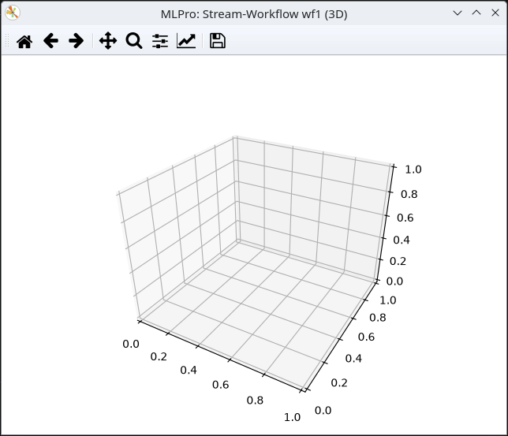

.. _Howto BF STREAMS MULTICLUSTER 009:

Howto BF-STREAMS-MULTICLUSTER-009: Two Dynamic Crossing 3D Clusters
==================================================================

**Executable code**

.. literalinclude:: ../../../../../../../../../test/howtos/bf/streams/stream_generation/multicluster/howto_bf_streams_multicluster_009_2_clusters_dynamic_crossing_3d.py
   :language: python

**Results**

**Cross Reference**
    - :ref:`API Reference: Streams <target_ap_bf_streams>`
