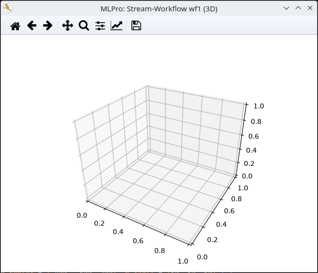

.. _Howto BF STREAMS MULTICLUSTER 010:

Howto BF-STREAMS-MULTICLUSTER-010: Two Dynamic Crossing 3D Clusters with Rescaled Outliers
===========================================================================================

**Executable code**

.. literalinclude:: ../../../../../../../../../test/howtos/bf/streams/stream_generation/multicluster/howto_bf_streams_multicluster_010_2_clusters_dynamic_crossing_3d_outlier_rescaled.py
   :language: python

**Results**

**Cross Reference**
    - :ref:`API Reference: Streams <target_ap_bf_streams>`
