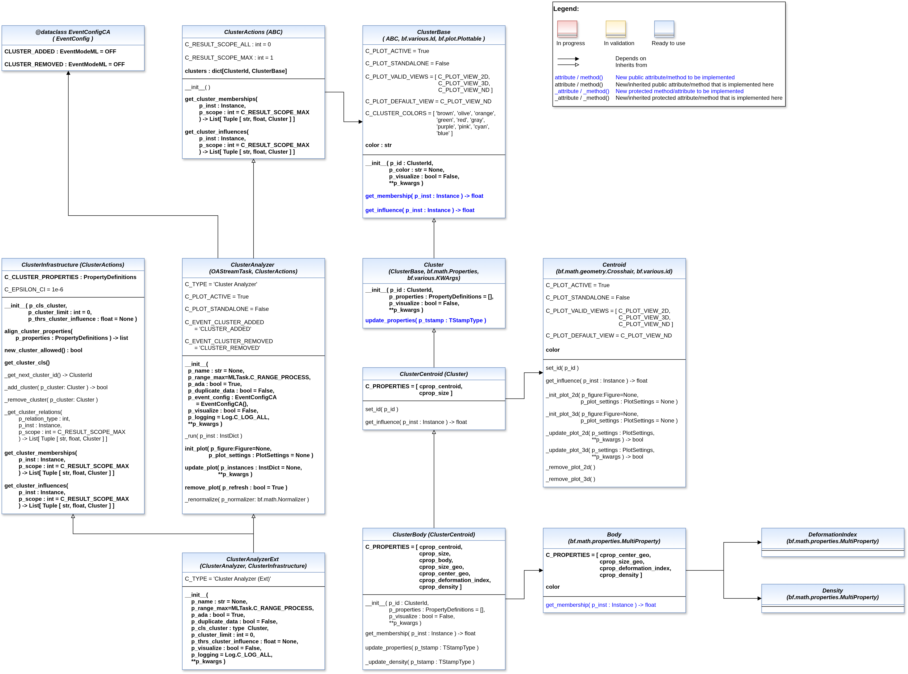

.. _target_api_oa_stream_tasks_clu:
Cluster analysis
================

The cluster-analysis API is organized as a lightweight core with optional standard MLPro infrastructure.

``ClusterActions`` defines the common cluster-facing API. ``ClusterAnalyzer`` combines this contract with ``OAStreamTask`` but
deliberately leaves the concrete cluster representation and management open. ``ClusterInfrastructure`` provides the reusable
standard MLPro mechanics, and ``ClusterAnalyzerExt`` combines both layers for conventional property-based implementations.

On cluster level, ``ClusterBase`` provides the minimal abstract representation independent of MLPro's property model, while
``Cluster`` adds the standard ``Properties`` and ``KWArgs`` infrastructure. ``EventConfigCA`` provides the cluster-specific event
switches ``CLUSTER_ADDED`` and ``CLUSTER_REMOVED``.

   
   
.. automodule:: mlpro.oa.streams.tasks.clusteranalyzers.basics
   :members:
   :undoc-members:
   :private-members:
   :show-inheritance:

.. automodule:: mlpro.oa.streams.tasks.clusteranalyzers.clusters.basics
   :members:
   :undoc-members:
   :private-members:
   :show-inheritance:

.. automodule:: mlpro.oa.streams.tasks.clusteranalyzers.clusters.centroid
   :members:
   :undoc-members:
   :private-members:
   :show-inheritance:

.. automodule:: mlpro.oa.streams.tasks.clusteranalyzers.clusters.body
   :members:
   :undoc-members:
   :private-members:
   :show-inheritance: